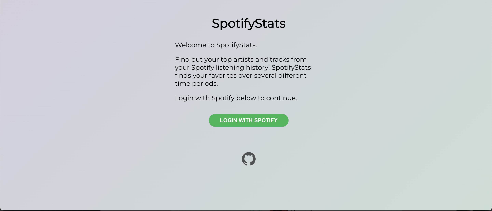
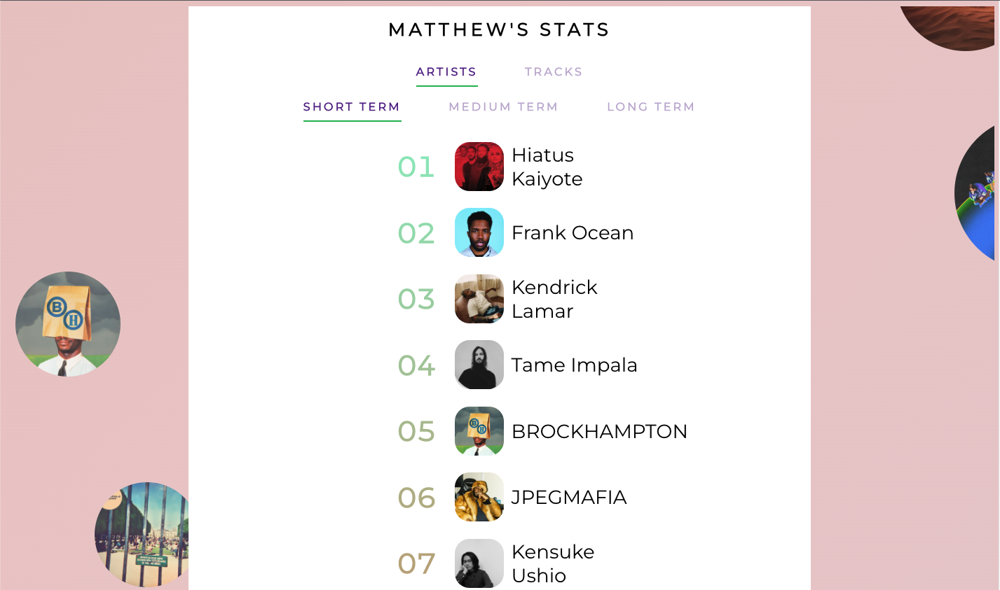
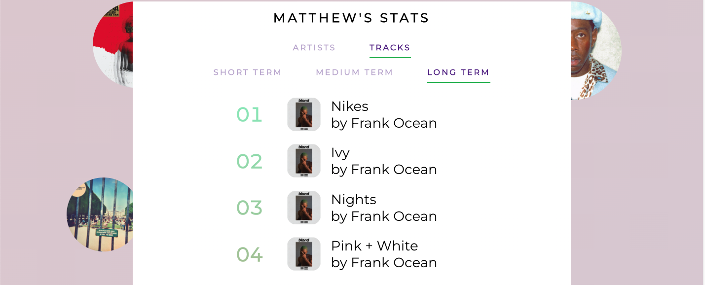

# Spotifstats

[spotifstats.com](https://www.spotifstats.com)

## What is this project?
Spotifstats is a website that shows your top artists and songs from your Spotify listening history! 
View your favorites across several time ranges to see how your listening patterns have 
changed (or maybe how they have not so much changed).

This site was made using Java as the back-end language, HTML + CSS + JavaScript for the front-end,
Maven to manage dependencies for the web-app side of things, and then deployment was done on Heroku.
The Spotify functionality comes from using 
the [Java Spotify API wrapper](https://github.com/thelinmichael/spotify-web-api-java) in the back-end.

## Photos

## What's next?
Optimizing the website to look nicer on mobile. Currently, this works best on a computer
monitor sized display. I'll probably revisit this in the future when I have some time
to learn more about mobile website optimization.